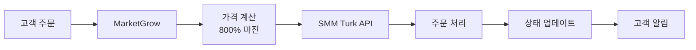

# 🚀 SMM Turk API 연동 가이드

## 📋 개요
MarketGrow에서 주문이 들어오면 자동으로 SMM Turk로 전달되는 시스템입니다.
- **800% 마진 적용**: SMM Turk 가격의 9배로 판매
- **자동 주문 전달**: 고객 주문 → MarketGrow → SMM Turk
- **실시간 상태 동기화**: 주문 상태 자동 업데이트

## 🔑 SMM Turk API 키 받기

1. **SMM Turk 가입**
   - https://smmturk.org 접속
   - 회원가입 진행

2. **API 키 발급**
   - 로그인 후 Dashboard → API 메뉴
   - API Key 생성 클릭
   - 생성된 키 복사

3. **잔액 충전**
   - Add Funds 메뉴에서 충전
   - 최소 $10부터 시작 가능

## ⚙️ 설정 방법

### 1단계: 환경 변수 설정
```bash
# backend/.env 파일 생성
SMMTURK_API_KEY=your_api_key_here
MARGIN_RATE=9.0  # 800% 마진
```

### 2단계: 서비스 동기화
```bash
cd backend
npm install
node smmturk-integration.js
```

### 3단계: 서버 실행
```bash
# 백엔드 서버
cd backend
npm start

# 프론트엔드 (별도 터미널)
cd ..
npm start
```

## 💰 가격 정책

### 마진 계산 방식
- SMM Turk 가격: $1.00
- 800% 마진 적용: $1.00 × 9.0 = $9.00
- 원화 환산 (환율 1,300원): ₩11,700

### 가격 예시
| 서비스 | SMM Turk | MarketGrow (800% 마진) | 이익 |
|--------|----------|----------------------|------|
| 인스타 팔로워 1000개 | ₩1,000 | ₩9,000 | ₩8,000 |
| 유튜브 조회수 1000개 | ₩800 | ₩7,200 | ₩6,400 |
| 틱톡 좋아요 1000개 | ₩500 | ₩4,500 | ₩4,000 |

## 📦 서비스 목록 동기화

### 자동 동기화 (추천)
```javascript
// 1시간마다 자동 동기화
setInterval(async () => {
    await syncServices();
}, 3600000);
```

### 수동 동기화
```bash
# API 호출
curl http://localhost:5001/api/smmturk/sync-services
```

## 🔄 주문 처리 흐름



## 📊 대시보드 기능

### 주문 관리
- 실시간 주문 상태 확인
- 주문 내역 조회
- 수익 계산

### 서비스 관리
- 서비스 활성화/비활성화
- 가격 수동 조정
- 재고 확인

## 🛠️ API 엔드포인트

### 서비스 관련
```bash
GET  /api/smmturk/services       # 서비스 목록
GET  /api/smmturk/sync-services  # 서비스 동기화
```

### 주문 관련
```bash
POST /api/smmturk/create-order   # 주문 생성
GET  /api/smmturk/order-status/:id # 주문 상태
```

### 관리 기능
```bash
GET  /api/smmturk/balance        # 잔액 확인
POST /api/smmturk/update-margin  # 마진율 변경
```

## 💡 수익 최적화 팁

### 1. 인기 서비스 집중
- 인스타그램 팔로워/좋아요
- 유튜브 조회수/구독자
- 틱톡 팔로워/좋아요

### 2. 패키지 상품 구성
```javascript
// 스타터 패키지 (30% 추가 할인)
const starterPackage = {
    instagram_followers: 1000,
    instagram_likes: 5000,
    original_price: 54000,  // (₩9,000 + ₩45,000)
    package_price: 37800    // 30% 할인
};
```

### 3. 프로모션 전략
- 첫 구매 20% 할인
- 대량 구매 시 추가 할인
- 정기 고객 VIP 혜택

## 🔍 문제 해결

### API 연결 실패
```bash
# API 키 확인
echo $SMMTURK_API_KEY

# 연결 테스트
curl -X POST https://smmturk.org/api/v2 \
  -d "key=YOUR_KEY&action=balance"
```

### 주문 실패
- 잔액 부족: SMM Turk 충전 필요
- 서비스 비활성: 다른 서비스 선택
- 링크 오류: URL 형식 확인

### 가격 동기화 문제
```javascript
// 수동 가격 업데이트
const updatePrices = async () => {
    const services = await fetchServices();
    services.forEach(s => {
        s.price = s.smmturk_price * 9.0;
    });
    await saveServices(services);
};
```

## 📈 수익 계산

### 일일 수익 예상
```
일 평균 주문: 50건
평균 주문액: ₩10,000
SMM Turk 원가: ₩1,111
마진 (800%): ₩8,889
일일 순익: ₩444,450
```

### 월간 수익 예상
```
월 평균 주문: 1,500건
월 매출: ₩15,000,000
월 원가: ₩1,666,500
월 순익: ₩13,333,500
```

## ✅ 체크리스트

- [ ] SMM Turk 계정 생성
- [ ] API 키 발급
- [ ] 잔액 충전 ($10+)
- [ ] .env 파일 설정
- [ ] 서비스 동기화 실행
- [ ] 테스트 주문 진행
- [ ] 가격 확인
- [ ] 결제 시스템 연동

## 🆘 지원

### SMM Turk 지원
- 이메일: support@smmturk.org
- 텔레그램: @smmturk_support

### 기술 문의
- API 문서: https://smmturk.org/api
- 상태 페이지: https://status.smmturk.org

---

**준비 완료!** 이제 SMM Turk API를 통해 자동화된 SNS 마케팅 서비스를 제공할 수 있습니다. 800% 마진으로 높은 수익을 창출하세요! 💰